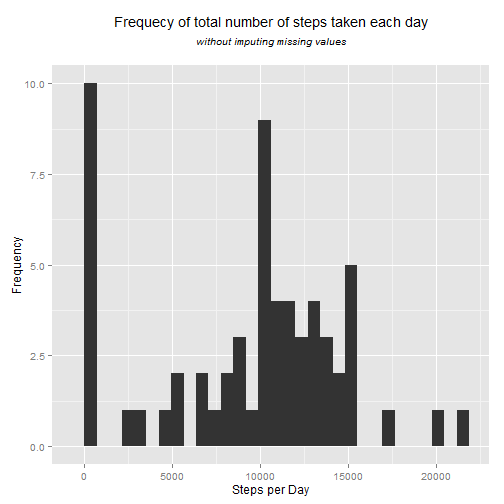
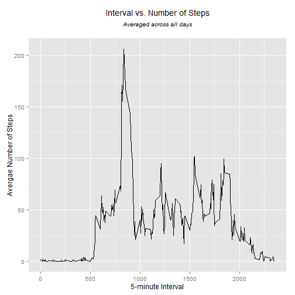
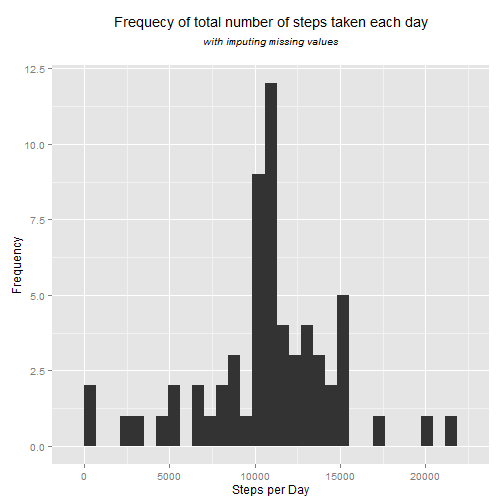
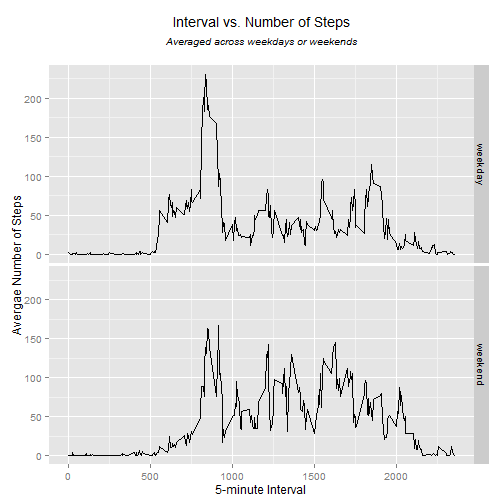

# Reproducible Research: Peer Assessment 1  
#### Personal Activity Data Analysis Report  

=========================================================================================

## Introduction
It is now possible to collect a large amount of data about personal movement using activity monitoring devices. But this data remains underutilized both because the raw data are hard to obtain and there is a lack of statistical methods and software for processing and interpreting the data.

This analysis makes use of data from a personal activity monitoring device. This device collects data at 5-minute intervals throughout the day. The data consists of two-month worth of data collected during October and November, 2012. The data includes the number of steps taken in 5-minute intervals each day.

## Data
The raw dataset can be obtained through this link [Activity Monitoring Data](https://d396qusza40orc.cloudfront.net/repdata%2Fdata%2Factivity.zip) as a zipped file. However, the code presented in this report downloads the dataset automatically for you to reporduce the research.

The raw dataset is comprised of the following variables:

* **steps**: Number of steps taken in a 5-minute interval (missing values are coded as NA).
* **date**: The date on which the measurement was taken in YYYY-MM-DD format.
* **interval**: Identifier for the 5-minute interval in which measurement was taken.

The dataset is stored in a comma-separated-value (CSV) file and there are a total of **17,568** observations in this dataset.

## Loading and preprocessing the data
The analysis starts by downloading the zipped raw data file. Then the file is unzipped.


```r
fileURL <- "https://d396qusza40orc.cloudfront.net/repdata%2Fdata%2Factivity.zip"
dataFileZIP <- "./repdata_data_activity.zip"

if (file.exists(dataFileZIP) == FALSE) {
        download.file(fileURL, destfile = dataFileZIP)
}
unzip(dataFileZIP)
```

Load the raw data file. (The first 10 rows of the raw data is shown below).


```r
RawData<-read.csv("./activity.csv")
head(RawData,10)
```

```
##    steps       date interval
## 1     NA 2012-10-01        0
## 2     NA 2012-10-01        5
## 3     NA 2012-10-01       10
## 4     NA 2012-10-01       15
## 5     NA 2012-10-01       20
## 6     NA 2012-10-01       25
## 7     NA 2012-10-01       30
## 8     NA 2012-10-01       35
## 9     NA 2012-10-01       40
## 10    NA 2012-10-01       45
```

### Loading necessary R Packages
The analysis uses some packages that need to be installed and loaded before running the code. The code below loads these packages. Yet, you need to make sure they are installed in your R version before loading.


```r
library(dplyr)
library(ggplot2)
```

## What is mean total number of steps taken per day?
The code uses the 'dplyr' package to calculate the total number of steps taken per day.
(The first 5 rows of the resulted dataset is shown below).


```r
df0<-group_by(RawData,date)
StepsPerDay<-summarize(df0,DaySteps=sum(steps,na.rm = TRUE))
head(StepsPerDay,5)
```

```
## Source: local data frame [5 x 2]
## 
##         date DaySteps
## 1 2012-10-01        0
## 2 2012-10-02      126
## 3 2012-10-03    11352
## 4 2012-10-04    12116
## 5 2012-10-05    13294
```

Make a histogram of the total number of steps taken each day (using the ggplot2 plotting system).


```r
g<-ggplot(StepsPerDay,aes(x=DaySteps))
g+geom_histogram()+
        labs(x="Steps per Day",y="Frequency")+        
        theme(plot.title = element_text(size = 14, face = "bold", colour = "black", vjust = +1))+        
        ggtitle(expression(atop("Frequecy of total number of steps taken each day",
                                atop(italic("without imputing missing values")))))
```

```
## stat_bin: binwidth defaulted to range/30. Use 'binwidth = x' to adjust this.
```

 

Calculate the mean and median of the total number of steps taken per day.


```r
MeanSteps<-as.integer(mean(StepsPerDay$DaySteps,na.rm=TRUE))
MedianSteps<-as.integer(median(StepsPerDay$DaySteps,na.rm = TRUE))
```

The mean value of the total number of steps taken per day is **9354**. Whereas the median value of the total number of steps taken per day is **10395**.

## What is the average daily activity pattern?

Make a time series plot of the 5-minute interval (x-axis) and 
the average number of steps taken, averaged across all days (y-axis).

In order to produce this plot we first summarize the raw data by creating the average steps per interval. (The first 5 rows of the averaged data is shown below).

Then, we plot intervals versus average number of steps in a time-series plot.


```r
df1<-group_by(RawData,interval)
AvgStepsPerInt<-summarize(df1,AvgSteps=mean(steps,na.rm = TRUE))

head(AvgStepsPerInt,5)
```

```
## Source: local data frame [5 x 2]
## 
##   interval  AvgSteps
## 1        0 1.7169811
## 2        5 0.3396226
## 3       10 0.1320755
## 4       15 0.1509434
## 5       20 0.0754717
```

```r
g<-ggplot(AvgStepsPerInt,aes(interval,AvgSteps))
g+geom_line()+
        labs(x="5-minute Interval",y="Avergae Number of Steps")+        
        theme(plot.title = element_text(size = 14, face = "bold", colour = "black", vjust = +1))+        
        ggtitle(expression(atop("Interval vs. Number of Steps",
                                atop(italic("Averaged across all days")))))
```

 

Get the 5-minute interval that-on average across all the days in the dataset- contains the maximum number of steps.


```r
MxSteps<-max(AvgStepsPerInt$AvgSteps)
MxStepsInt<-as.integer(AvgStepsPerInt$interval[which(AvgStepsPerInt$AvgSteps==MxSteps)])
MxSteps<-as.integer(MxSteps)
```

The 5-minute interval, on average across all the days in the dataset, that contains the maximum number of steps is interval **835** with a maximum number of steps of **206** steps.

## Imputing missing values

Note that there are a number of days/intervals where there are missing values (coded as NA). The presence of missing days may introduce bias into some calculations or summaries of the data.

Calculate the total number of missing values in the dataset.


```r
NAs<-sum(is.na(RawData$steps))
```

The total number of missing values in the dataset is **2304**.

We need to devise a strategy for filling in all of the missing values in the dataset.
The mean of steps taken across all days for the 5-minute interval corresponding to the missing value will be used as a strategy to fill in the missing values.

To do that we first create a new dataset that is equal to the original dataset.


```r
ProData<-RawData
```

Then, we replace the NAs by their average 'steps' from the AvgStepsPerInt dataset for the same interval. (The first 5 rows of the new data set with filled NAs is shown below).


```r
ProData$steps[ProData$interval==AvgStepsPerInt$interval & is.na(ProData$steps)]<-AvgStepsPerInt$AvgSteps

head(ProData,5)
```

```
##       steps       date interval
## 1 1.7169811 2012-10-01        0
## 2 0.3396226 2012-10-01        5
## 3 0.1320755 2012-10-01       10
## 4 0.1509434 2012-10-01       15
## 5 0.0754717 2012-10-01       20
```

For the new dataset (with NAs filled in), we will make a histogram of the total number of steps taken each day, then see the impact of imputing missing data on the estimates of the total daily number of steps.

First, we calculate the mean total number of steps taken per day. Then make the Histogram.


```r
df2<-group_by(ProData,date)
StepsPerDayPro<-summarize(df2,DaySteps=sum(steps,na.rm = TRUE))

head(StepsPerDayPro,5)
```

```
## Source: local data frame [5 x 2]
## 
##         date DaySteps
## 1 2012-10-01 10766.19
## 2 2012-10-02   126.00
## 3 2012-10-03 11352.00
## 4 2012-10-04 12116.00
## 5 2012-10-05 13294.00
```

```r
g<-ggplot(StepsPerDayPro,aes(x=DaySteps))
g+geom_histogram()+
        labs(x="Steps per Day",y="Frequency")+        
        theme(plot.title = element_text(size = 14, face = "bold", colour = "black", vjust = +1))+        
        ggtitle(expression(atop("Frequecy of total number of steps taken each day",
                                atop(italic("with imputing missing values")))))
```

```
## stat_bin: binwidth defaulted to range/30. Use 'binwidth = x' to adjust this.
```

 

Calculate the mean and median of the total number of steps taken per day for the new dataset.


```r
MeanStepsPro<-as.integer(mean(StepsPerDayPro$DaySteps,na.rm=TRUE))
MedianStepsPro<-as.integer(median(StepsPerDayPro$DaySteps,na.rm = TRUE))
```

The mean value of the total number of steps taken per day for the new dataset is **10766**. And the median value is also **10766**.

Notice that the mean and median for the imputed missing values data set are different from those in the first part (without imputing missing values). Both mean and median in the new dataset are higher than mean and median in the original dataset, respectviely.

The impact of imputing missing data on the estimates of the total daily number of steps is that it eliminates skewness and bias in the data and converts the data distribution into unimodal probability distribution where mean and median are equal. Whereas the dataset with missing values exhibits skewness as implied by median being higher than the mean.

## Are there differences in activity patterns between weekdays and weekends?

Notice that we will use the dataset with the filled-in missing values for this part (the new dataset). The aim here is to see the differences in activity patterns between weekdays and weekends.

create a new factor variable in the dataset with two levels - "weekday" and "weekend" indicating whether a given date is a weekday or weekend day (Sat and Sun are considered the weekend days).

First, we will create a variable in the new dataset named 'Day' presenting the day of the week. Then we will create the factor variable of 'weekday' and 'weekend' (DayType). (The first 5 rows of the new data set with Day Type is shown below)


```r
ProData$Day<- weekdays(as.Date(ProData$date),abbreviate = TRUE)
ProData$DayType<-as.factor(ifelse(ProData$Day %in% c("Sat","Sun"),"weekend","weekday"))

head(ProData,5)
```

```
##       steps       date interval Day DayType
## 1 1.7169811 2012-10-01        0 Mon weekday
## 2 0.3396226 2012-10-01        5 Mon weekday
## 3 0.1320755 2012-10-01       10 Mon weekday
## 4 0.1509434 2012-10-01       15 Mon weekday
## 5 0.0754717 2012-10-01       20 Mon weekday
```

Make a panel plot containing a time series plot (i.e.  type = "l" ) of the 5-minute 
interval (x-axis) and the average number of steps taken, averaged across all weekday
days or weekend days (y-axis).

First, we need to summarize the new data by creating the average steps per interval per Day Type. Then, we plot intervals versus average number of steps into two panels; one for weekday and another for weekend.


```r
df3<-group_by(ProData,DayType,interval)
AvgStepsPerIntWd<-summarize(df3,AvgSteps=mean(steps))

head(AvgStepsPerIntWd,5)
```

```
## Source: local data frame [5 x 3]
## Groups: DayType
## 
##   DayType interval   AvgSteps
## 1 weekday        0 2.25115304
## 2 weekday        5 0.44528302
## 3 weekday       10 0.17316562
## 4 weekday       15 0.19790356
## 5 weekday       20 0.09895178
```

```r
g<-ggplot(AvgStepsPerIntWd,aes(interval,AvgSteps))
g+geom_line()+facet_grid(DayType~.)+
        labs(x="5-minute Interval",y="Avergae Number of Steps")+        
        theme(plot.title = element_text(size = 14, face = "bold", colour = "black", vjust = +1))+        
        ggtitle(expression(atop("Interval vs. Number of Steps",
                                atop(italic("Averaged across weekdays or weekends")))))
```

 

From the above plots we can conclude that activity patterns for weekdays and weekends are nearly similar. However, the below calculations of means can shed more light on the difference.

Let's calculate the mean of the average number of steps per interval for each of the weekdays and weekends.


```r
tapply(AvgStepsPerIntWd$AvgSteps,AvgStepsPerIntWd$DayType,mean)
```

```
##  weekday  weekend 
## 35.61058 42.36640
```

Based on the results, the mean of number of steps per interval for weekdays is lower than that of the weekend. On average, this may imply that higher activities are performed during weekends than weekdays.

======================================END OF REPORT======================================
